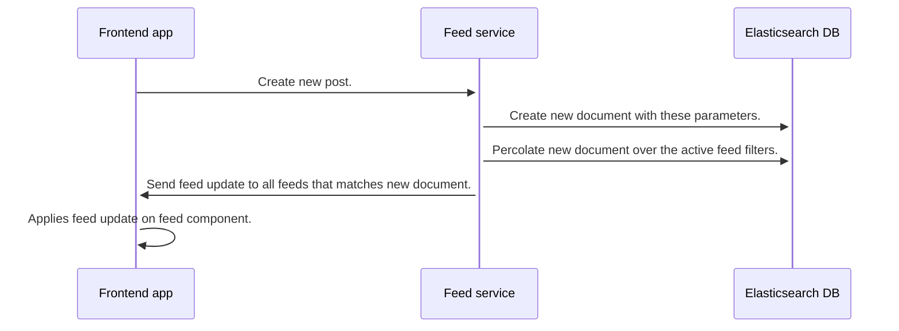
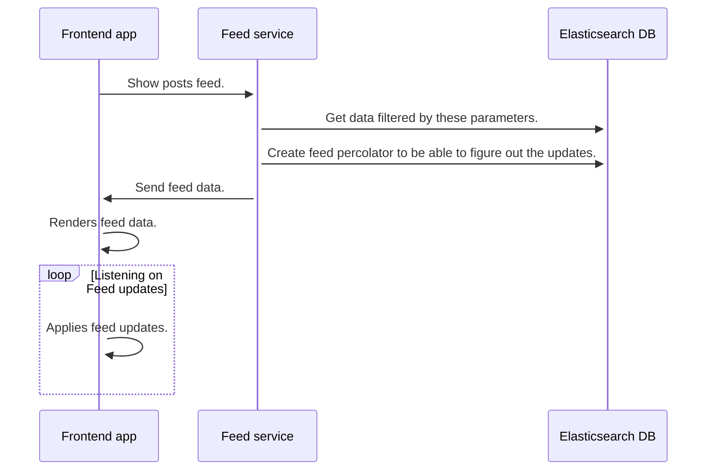
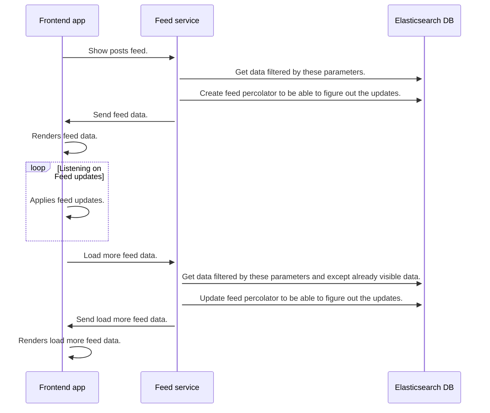

# Data flows

## Content actions flow

```mermaid
sequenceDiagram
    Frontend app->>+Feed service: Create new post.
    Feed service->>+Elasticsearch DB: Create new document with these parameters.
    Feed service->>+Elasticsearch DB: Percolate new document over the active feed filters.
    Feed service->>+Frontend app: Send feed update to all feeds that matches new document.
    Frontend app->>+Frontend app: Applies feed update on feed component.
```

## Feed flow

### Get feed data

```mermaid
sequenceDiagram
    Frontend app->>+Feed service: Show posts feed.
    Feed service->>+Elasticsearch DB: Get data filtered by these parameters.
    Feed service->>+Elasticsearch DB: Create feed percolator to be able to figure out the updates.
    Feed service->>+Frontend app: Send feed data.
    Frontend app->>+Frontend app: Renders feed data.
    loop Listening on Feed updates
     Frontend app->>Frontend app: Applies feed updates.
    end
```

### Load more data

```mermaid
sequenceDiagram
    Frontend app->>+Feed service: Show posts feed.
    Feed service->>+Elasticsearch DB: Get data filtered by these parameters.
    Feed service->>+Elasticsearch DB: Create feed percolator to be able to figure out the updates.
    Feed service->>+Frontend app: Send feed data.
    Frontend app->>+Frontend app: Renders feed data.
    loop Listening on Feed updates
     Frontend app->>Frontend app: Applies feed updates.
    end
    Frontend app->>+Feed service: Load more feed data.
    Feed service->>+Elasticsearch DB: Get data filtered by these parameters and except already visible data.
    Feed service->>+Elasticsearch DB: Update feed percolator to be able to figure out the updates.
    Feed service->>+Frontend app: Send load more feed data.
    Frontend app->>+Frontend app: Renders load more feed data.
```
