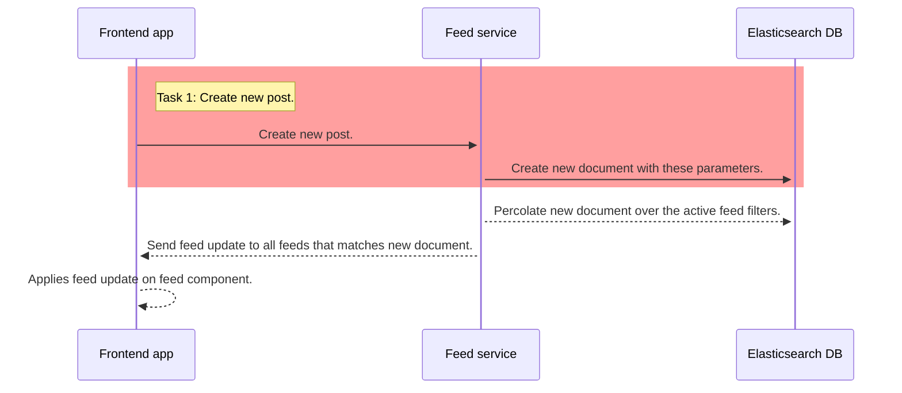

# Create new post call

- It's just about saving new content in the database.
- We are going to use the `@elastic/elasticsearch` client
- Up to you if you are going to use use create or index API (psst but with the index API you can perform updates as well 🤫)

```
client.index({
    index: 'the name of the index',
    body: {
        'field name: 'field value',
        ...
    }
})
```

⚠️ Only the red rectangle are is part of this task ⚠️


