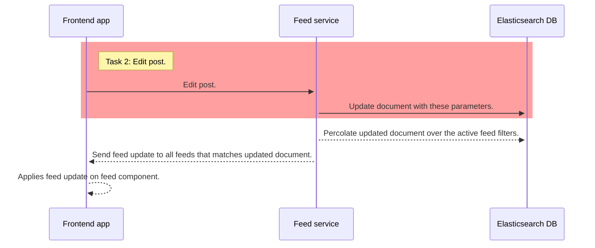

# Update post call

- It's just about updating a content in the database.
- We are going to use the `@elastic/elasticsearch` client
- Up to you if you are going to use use create or index API (psst but with the index API you can perform updates as well 🤫)

⚠️ Only the red rectangle are is part of this task ⚠️

