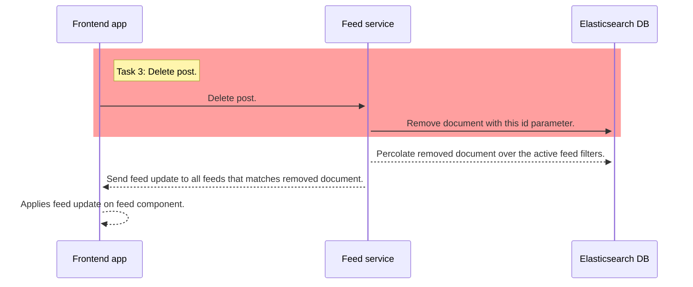

# Delete post call

- It's just about removing a content in the database.
- We are going to use the `@elastic/elasticsearch` client
- use the delete API for it

```
client.delete({
    index: 'the name of the index',
    id: 'id of the document'
})
```

⚠️ Only the red rectangle are is part of this task ⚠️


