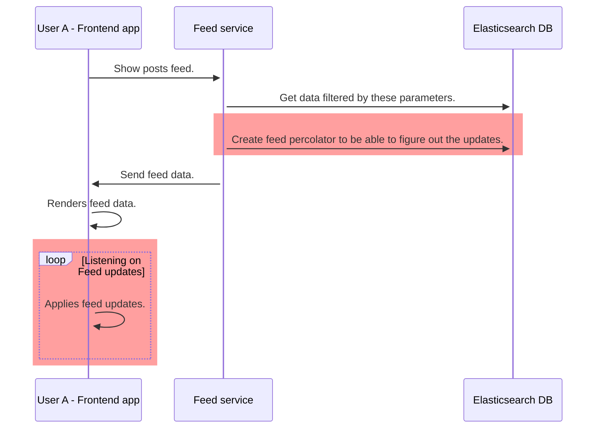
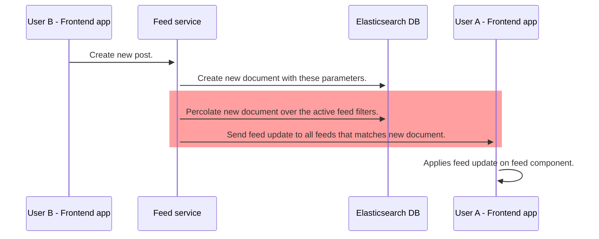

# Register and send update

## Todo

1. We need to save filters of active feeds to be able to percolate created/edited/removed documents over the active filters
   - create new index for the percolations
   - save the feed filter
1. When C/U/D operation happening we will percolate the document over the saved filters
1. If we found a match then send the update

### User A consumes the data



### User B alters the data



## Percolation

### Saving feed filter

```
client.index({
    index: 'the name of the index',
    id: 'id of the document (feed id)'
    body: {
        feed_id: 'id matching the document id',
        query: 'contains the feed filter applied',
    }
})
```

### Querying percolations

- Using standard search `client.search({...})`

```
client.search({
    index: 'percolation index',
    body: {
        query: {
            percolate: {
                field: 'name of the percolator field',
                ... percolation query ...
            }
        }
    }
})
```

You can use data fields or id and index as percolator query

#### Data fields

```
{
    document: {
        network: 'instagram',
        labels: ['sample 1', 'sample 2']
    }
}
```

#### Index & id

```
{
    index: 'name of the source index',
    id: 'id of the document you want to percolate with',
}
```
